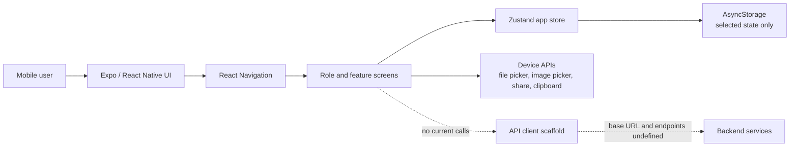
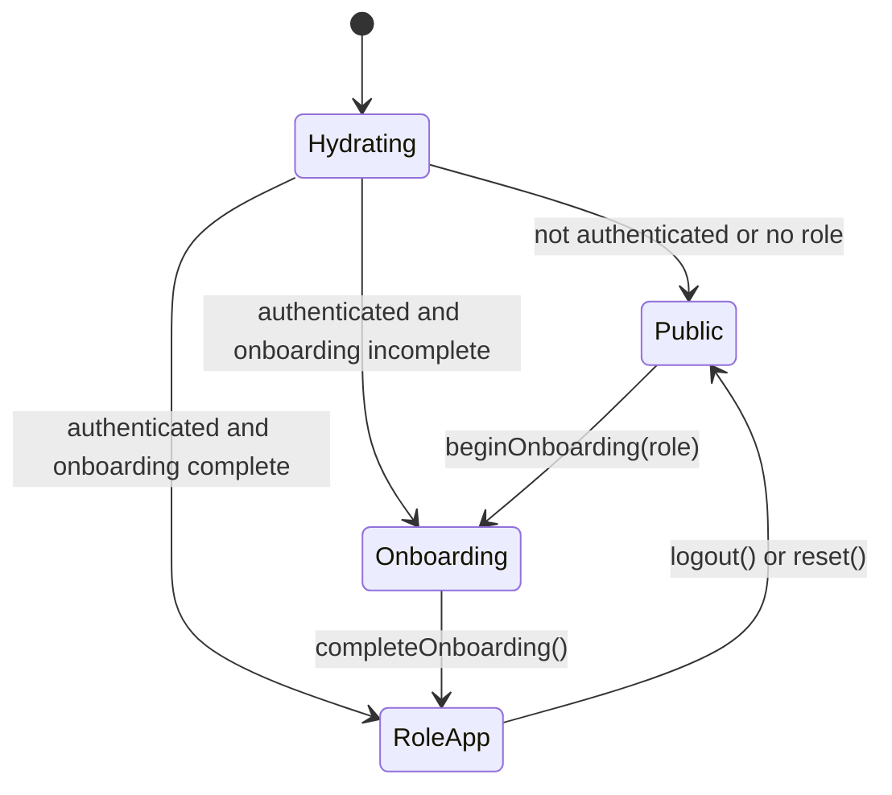
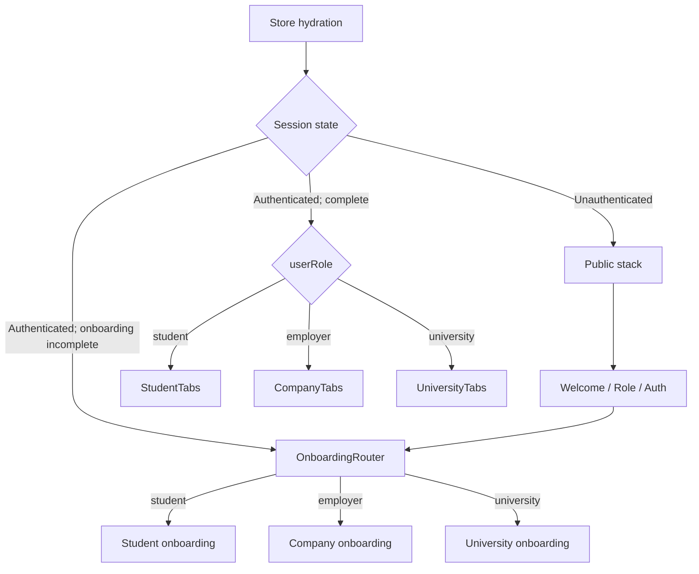
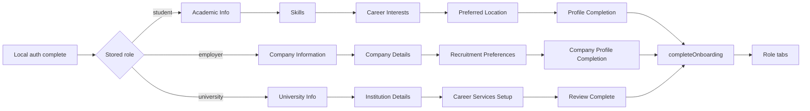
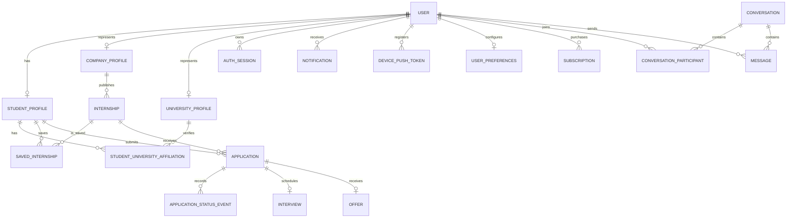
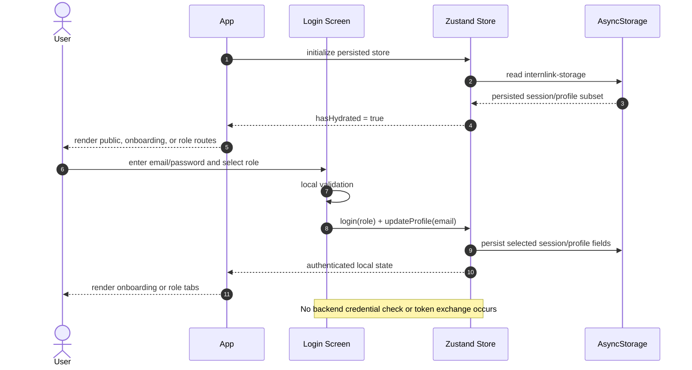
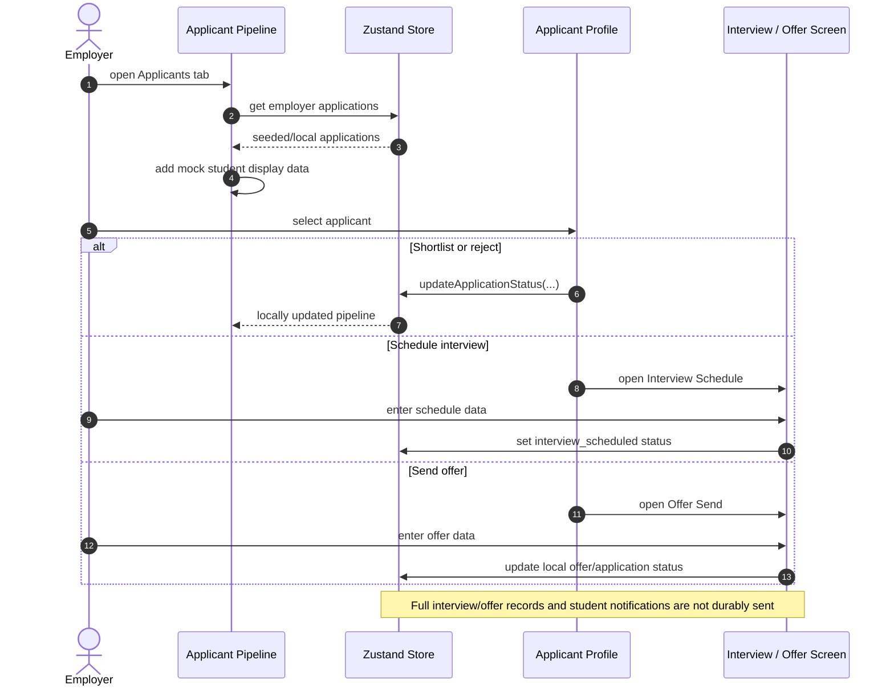
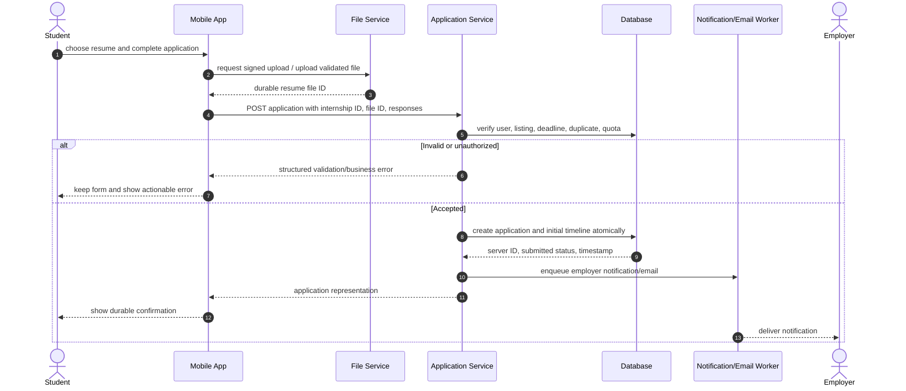

# InternLink Frontend System Design Document

**Document basis:** Current React Native/Expo frontend source code  
**Analysis date:** 2026-07-21  
**Application status:** Frontend prototype with local mock data and local state; backend integration has not started

## Status terminology

This document uses the following terms deliberately:

- **Implemented (frontend):** A screen or interaction exists and can run in the app. It may still use mock data or local state.
- **Local-only:** The interaction changes component state, Zustand state, or persisted `AsyncStorage`; it does not call a backend.
- **UI-only:** The control or screen exists, but the main action is a placeholder, log, alert, or visual simulation.
- **Registered but not known to be reachable:** The route is registered in the active root stack, but no active screen navigates to it.
- **Inactive/refactor candidate:** Code exists in the repository but is not connected to the runtime entrypoint.
- **Proposed/inferred:** A backend capability is required by an existing frontend feature, but no concrete endpoint is implemented or configured in the frontend.

> Important: the endpoint paths in Section 9 are an inferred integration contract. They are not claims about the current backend and are not called by the current frontend.

## 1. Executive Summary

InternLink is a three-sided internship platform implemented as an Expo/React Native application. It provides separate experiences for students, companies/employers, and universities. The frontend includes authentication and onboarding interfaces, internship discovery and application workflows, employer listing and applicant-management workflows, university placement dashboards, messaging, notifications, settings, and a premium subscription interface.

The application is currently a functional frontend prototype rather than an integrated production system. Navigation, theming, local form validation, and many role-specific workflows are implemented. Most business data is hardcoded or seeded in a single Zustand store. Authentication accepts locally validated inputs, email verification and password recovery are simulated, messaging is local, payments are simulated, and no screen calls a live API.

The active application shell is a manually registered flat stack in `App.tsx`. It chooses one of three high-level states after the Zustand store hydrates:

1. public authentication screens;
2. role-specific onboarding; or
3. a role-specific authenticated application.

The repository also contains a partly built navigator refactor under `src/navigation/`, but those navigators are not integrated. `expo-router` is installed and configured as a plugin but is not used for routing.

The most important work before or during backend integration is to establish a concrete API contract, use secure token storage, replace seeded domain data with server queries and mutations, consolidate duplicate data sources and screens, correct route inconsistencies, and add tests and automated validation. The existing `src/api/client.ts` is a useful transport foundation, but it is not instantiated and does not yet define application endpoints.

## 2. Purpose of the Application

The frontend indicates that InternLink is intended to connect three participant groups around internship placement:

- **Students** create a professional and academic profile, discover and save internships, submit applications, monitor application progress, communicate with employers, and manage interviews or offers.
- **Companies/employers** create an organization profile, publish internship listings, review applicants, move applications through a hiring pipeline, schedule interviews, send offers, and communicate with students.
- **Universities** monitor student placement outcomes, review placement analytics, inspect company engagement, and produce placement reports.

The application also presents premium student features and limits free application usage, although billing and entitlement verification are currently simulated locally.

There is no Admin role, Admin navigator, or Admin screen in the current frontend. Administrative capabilities should therefore not be treated as part of the implemented product.

## 3. Overall Architecture

### 3.1 Technology stack

| Layer | Current technology | Current use |
|---|---|---|
| Runtime | Expo SDK 54, React Native 0.81, React 19.1 | Cross-platform mobile application |
| Language | TypeScript with strict mode | Screens, navigators, store, types, and shared components |
| Navigation | React Navigation Stack v7 and Bottom Tabs v7 | Active routing through `App.tsx` and role tab navigators |
| Local state | Zustand 5 | Authentication flags, onboarding state, profile data, domain mock data, and UI preferences |
| Persistence | Zustand `persist` + React Native `AsyncStorage` | Selected session/profile/preferences only |
| Theme | Custom `ThemeProvider`, `useAppTheme()`, and `src/constants/Colors.ts` | System/light/dark color selection |
| Files/media | Expo Document Picker and Image Picker | Resume, logo, and profile-image selection using local URIs |
| Visuals | Expo Linear Gradient, React Native SVG, Chart Kit | Branded UI and university analytics charts |
| Network foundation | `src/api/client.ts` | Generic HTTP client scaffold; currently unused |

### 3.2 Runtime context



The current data plane ends at local component state, Zustand, or device APIs. A production backend, database, object storage, notification provider, real-time messaging channel, email provider, and payment provider are implied by the UI but are not connected.

### 3.3 Application lifecycle and access gating

`index.ts` registers `App.tsx`. The root component wraps the application in gesture, safe-area, theme, and navigation providers. It waits for the persisted store to hydrate before selecting the route set.



This is client-side route gating, not a security boundary. A backend must independently authenticate the caller and authorize every resource.

### 3.4 Current architectural boundaries

- **Presentation and navigation:** `App.tsx`, feature screens in `app/`, and active tab/stack navigators.
- **Shared presentation:** components, constants, hooks, and theme context in `src/`.
- **Client state/domain simulation:** one persisted Zustand store in `src/store/useAppStore.ts`.
- **Domain types:** application, listing, conversation, notification, interview, and offer types in `src/types/application.ts`.
- **Integration seam:** generic types and HTTP transport in `src/api/`; it is intentionally not bound to a backend URL or endpoint map.

## 4. Frontend Architecture

### 4.1 Folder structure

```text
InternLink/
├── App.tsx                         # Active root navigator and access gates
├── index.ts                        # Expo entrypoint; registers App
├── app.json                        # Expo configuration
├── package.json                    # Dependencies and scripts
├── app/
│   ├── AuthScreens/                # Role selection, login, signup, verification, recovery
│   ├── StudentOnboardingScreens/   # Academic, skills, interests, location, completion
│   ├── CompanyOnboardingScreens/   # Company details and recruitment preferences
│   ├── UniversityOnboarding/       # Institution and career-service onboarding
│   ├── StudentExperienceScreens/   # Student tabs and feature screens
│   ├── CompanyExperienceScreens/   # Company tabs and employer workflows
│   ├── UniversityExperience/       # University tabs, analytics, and detail screens
│   ├── SettingsComponents/         # Shared account, preference, and legal screens
│   ├── PremiumScreens/             # Paywall, payment, confirmation, management
│   ├── SystemStateScreens/         # Empty/loading/error/success/search states
│   ├── OnboardingRouter.tsx        # Maps a role to its first onboarding screen
│   ├── SplashScreen.tsx
│   └── WelcomeOnboardingScreen.tsx
├── src/
│   ├── api/                        # Unbound HTTP client and API/session types
│   ├── components/                 # Shared visual components
│   ├── constants/                  # Active palette and related constants
│   ├── context/                    # ThemeProvider
│   ├── hooks/                      # useAppTheme
│   ├── navigation/                 # Planned navigator refactor; not active
│   ├── store/                      # Single Zustand app store
│   ├── types/                      # Application-domain types
│   └── utils/                      # Small validation helpers
├── types/navigation.ts             # Active root route parameter types
├── constants/theme.ts              # Legacy theme constants
├── assets/                         # App icons and images
└── docs/                           # Project documentation
```

The source is organized primarily by screen/role rather than by end-to-end feature modules. Cross-cutting code is under `src/`, while most screen-specific types, mock data, and behavior remain inside screen files.

### 4.2 Navigation architecture and flow

#### Active root navigation

The real navigator is the single conditional stack in `App.tsx`. More than 40 screens are registered manually. Every root stack screen hides its header and uses a fade transition.



`OnboardingRouter.tsx` performs the following role mapping with `replace`:

| Stored role | First onboarding route |
|---|---|
| `student` | `AcademicInfo` |
| `employer` | `CompanyInformation` |
| `university` | `UniversityInfo` |

#### Role tabs

| Role | Active tab structure |
|---|---|
| Student | Home, Discover, Saved, Applications, Profile |
| Company/employer | Dashboard, Listings, Applicants, Company, Settings |
| University | Overview, Students, Analytics, Reports, Settings |

The student Home tab contains a nested `HomeStack` for the dashboard, notifications, student messages/chat, help, calendar, and referrals. Other details and multi-step workflows are registered in the root stack.

#### Inactive navigation code

`src/navigation/AuthNavigator.tsx`, `StudentAppNavigator.tsx`, and related files represent a planned navigator decomposition, but `App.tsx` does not mount them. They should not be documented or tested as active navigation. `expo-router` is also not active despite being present in dependencies and Expo configuration.

#### Navigation risks visible in the current source

- The employer dashboard navigates its notification bell to `Notifications`, but that route is registered only in the student authenticated branch.
- Several screens are registered but have no active caller, including `StudentEditProfile`, `NewInternshipDetails`, and several system-state screens.
- `ApplicantDetailScreen`, `ApplicantsScreen`, and `ApplicationSentScreen` exist but are not part of the active route graph.
- Some navigation parameter types use permissive `any`/flexible shapes. For example, discovery can pass a partial internship object to a route whose canonical type is richer.
- The company onboarding completion and review-complete screens overlap; the normal flow completes from `CompanyProfileCompletion`, leaving the extra review screen without a clear active entry.

### 4.3 State management

The application uses a single Zustand store with `persist` middleware. It combines session state, profile/onboarding data, business entities, messaging, analytics helpers, and UI preferences.

| State domain | Examples | Source today | Persisted across launches? |
|---|---|---|---|
| Hydration/session | `hasHydrated`, `isAuthenticated`, `userRole`, user ID/name | Zustand | Session subset: yes |
| Onboarding | role and completion flag | Zustand | Yes |
| Theme | `themePreference` | Zustand | Yes |
| Profile/preferences | contact details, photo, bio, skills, resume, academic and job preferences | Zustand | Selected fields: yes |
| Premium | entitlement and free application counter/limit | Zustand | Yes |
| Applications | application records, statuses, timeline, draft | Seeded/local Zustand | No |
| Employer listings | listing records and publish state | Seeded/local Zustand | No |
| Saved internships | saved IDs | Local Zustand | No |
| Notifications | notification list and read state | Seeded/local Zustand | No |
| Conversations/messages | conversations and chat messages | Seeded/local Zustand | No |
| Employer analytics | derived counts and rates | Derived from local store | Recomputed |

The storage key is `internlink-storage`, currently version 2. A migration reads older profile-related `AsyncStorage` keys. The store intentionally persists only a subset of state; consequently, applications, listings, saves, notification state, and messages reset to defaults after a fresh app-store creation.

`login(role)` is currently a mock action that accepts the selected role and assigns a fixed local ID such as `student-1`. `establishSession(...)` exists as a future integration action capable of mapping an authenticated backend session into the store, but no screen calls it.

#### State-management concerns

- A single store owns unrelated server-like domains, which will become difficult to invalidate and synchronize when APIs are added.
- Hardcoded IDs and seeded records couple screens to mock identities.
- Server state has no loading, stale, retry, pagination, conflict, or cache semantics.
- Local status updates can create states the server has not authorized or persisted.
- Persistence is unencrypted and is not appropriate for access or refresh tokens.

### 4.4 Theme management

The active theme path is:

```text
system color scheme + persisted themePreference
    -> ThemeProvider
    -> useAppTheme()
    -> light/dark palette in src/constants/Colors.ts
    -> screen/component styles
```

`app.json` uses `userInterfaceStyle: "automatic"`, and the store supports `light`, `dark`, and `system`. `src/constants/Colors.ts` is the canonical, extensive palette. `constants/theme.ts` is legacy and should not receive new tokens.

Most screens use `useAppTheme()`, but the migration is not fully complete: some university screens and a filter modal still define active hardcoded color blocks, and many files contain individual hardcoded color literals. These can produce inconsistent dark-mode behavior.

### 4.5 Component hierarchy

```text
App
└── GestureHandlerRootView
    └── SafeAreaProvider
        └── ThemeProvider
            └── NavigationContainer
                └── Root Stack (conditional route set)
                    ├── Public/authentication screens
                    ├── OnboardingRouter -> role onboarding screens
                    └── Role application
                        ├── StudentTabs -> HomeStack and student screens
                        ├── CompanyTabs -> employer screens
                        └── UniversityTabs -> university screens
```

Reusable components currently include:

| Component | Intended responsibility | Current adoption |
|---|---|---|
| `PrimaryButton` | Themed primary action | Exists but is not broadly used by screens |
| `StatusBadge` | Consistent application status label/color | Used in application views |
| `ApplicationTimeline` | Application progress visualization | Used in application details |
| `EmptyState` | Reusable empty-state treatment | Exists; limited/no active screen use |
| `ProgressBar` | Shared progress display | Exists; limited/no active screen use |
| `SkeletonCard` | Loading placeholder | Exists; limited/no active screen use |

Most screens still define their own buttons, cards, inputs, headers, mock data, and styles. This yields visual flexibility but also duplication and inconsistent behavior.

## 5. User Roles

| Role | Implemented frontend capabilities | Important current limitations |
|---|---|---|
| Student | Academic/profile onboarding, internship discovery/search/filter, saving, multi-step applications, application tracking, local messages, calendar, settings, premium UI | Internships and applications are mock/local; saves/messages are not persisted; no real resume upload, notification delivery, email, identity, or payment |
| Company (`employer` internally) | Company onboarding, dashboard, local listing wizard, applicant pipeline, applicant details, local interview/offer status actions, messages, local insights | Listing screens use inconsistent data sources; status changes are local; interview/offer objects are not fully saved; employer notification route is broken |
| University | Institution onboarding, overview dashboard, student monitoring, analytics, reports, partner-company views, profile/settings UI | Most data is hardcoded; report generation/download and settings actions are placeholders; no university-to-student data relationship is loaded from a backend |
| Admin | Not present | No Admin role, screens, routes, permissions, or workflows exist in this frontend |

## 6. Screen-by-Screen Breakdown

### 6.1 Public and authentication screens

| Screen | Status | Purpose | Inputs | Outputs/state effects | Main navigation |
|---|---|---|---|---|---|
| Splash | Implemented frontend | Display launch branding while local state hydrates and assets prefetch | No user data | Waits for hydration/prefetch only | Public users go to Welcome; authenticated routing is controlled by the root gate |
| Welcome Onboarding | Implemented frontend | Introduce the product in a three-slide carousel | Swipe and next/back taps | Component-only slide index | Role Selection or Login |
| Role Selection | Implemented frontend | Choose an account type | Student, company, or university selection | Passes selected role as a route parameter | Sign Up |
| Login | Local-only mock | Collect credentials and choose a role | Email, password, role; Google button | Validates locally, stores email, invokes mock `login(role)`; Google only logs | Root gate selects onboarding or role app; Forgot Password; Sign Up |
| Sign Up | Local-only mock | Collect a new user's basic account data | Full name, email, password, password confirmation, terms acceptance | Local validation; stores name/email | Verification |
| Verification | UI/local-only | Collect a six-digit email verification code | Six code digits, resend tap | Does not verify against a service; starts local onboarding for the role | `OnboardingRouter` |
| Forgot Password | UI-only | Request a password reset | Email | Toggles a local “sent” state; no email is sent | Back to Login |
| Terms of Service | Static content | Display terms and conditions | Scrolling/back | None | Back |
| Privacy Policy | Static content | Display privacy policy | Scrolling/back | None | Back |

### 6.2 Student onboarding screens

| Screen | Status | Purpose | Inputs | Outputs/state effects | Main navigation |
|---|---|---|---|---|---|
| Academic Info | Local-only | Capture education details | University, programme, level, graduation year | Saves academic fields to Zustand | Skills |
| Skills | Local-only | Select searchable skills; also reused for profile editing | Search text and selected skills | Saves `profile.skills` | Career Interests during onboarding; back when editing |
| Career Interests | Local-only | Capture desired career categories | Selected interests | Saves career interests to Zustand | Preferred Location |
| Preferred Location | Local-only | Capture preferred location and work style | City/location, work setup, relocation preference | Saves location preferences | Profile Completion; skip can complete onboarding |
| Profile Completion | Local/device-only | Finish the student profile | Username/profile fields, bio, portfolio, resume document, profile image where available | Saves profile values and local file URIs; marks onboarding complete | Root gate opens Student Tabs |

The university selector and other option lists are bundled frontend data. Resume and image selection produce device-local URIs; no file is uploaded.

### 6.3 Company onboarding screens

| Screen | Status | Purpose | Inputs | Outputs/state effects | Main navigation |
|---|---|---|---|---|---|
| Company Information | Component-local prototype | Capture company identity/contact data | Company name, email, phone, website, logo document/image | Values remain in the screen flow; some sample defaults are prefilled | Company Details |
| Company Details | Component-local prototype | Capture organization characteristics | Industry, size, headquarters, description | Component-local data | Recruitment Preferences |
| Recruitment Preferences | Component-local prototype | Capture target categories and working preferences | Categories, qualifications, work setup | Component-local data | Company Profile Completion |
| Company Profile Completion | Local-only | Review/finish company onboarding | Confirm, edit, cancel | Completion updates the local session; edit is incomplete | Root gate opens Company Tabs |
| Company Review Complete | Registered but not known to be reachable | Alternate/duplicate review-completion presentation | Confirm, edit, cancel | Local completion only; edit is incomplete | Company Tabs through root gate |

Unlike student onboarding, company form data is not represented as a complete persisted organization model in the central store, so values collected in early screens cannot yet form a reliable integration payload.

### 6.4 University onboarding screens

| Screen | Status | Purpose | Inputs | Outputs/state effects | Main navigation |
|---|---|---|---|---|---|
| University Info | UI/component-local | Capture institution identity | Institution name/type/contact and logo-related fields | Values are local/logged; no institution record is saved | Institution Details |
| Institution Details | UI/component-local | Capture institution size and academic context | Type, country, city, student count, academic programmes | Values are local/logged | Career Services Setup |
| Career Services Setup | UI/component-local | Capture career-services contacts | Department/contact/coordinator details | Values are local/logged | University Review Complete |
| University Review Complete | Local-only | Review and complete onboarding | Confirm, edit, cancel | Marks local onboarding complete; edit actions are incomplete | Root gate opens University Tabs |

### 6.5 Student application screens

| Screen | Status | Purpose | Inputs | Outputs/state effects | Main navigation |
|---|---|---|---|---|---|
| Student Home Dashboard | Frontend/local | Show recommendations, application summary, quick actions, and premium usage | Card taps and shortcut actions | Reads hardcoded recommendations and local counters | Internship Details, Notifications, Messages, Help, Calendar, Refer Friend, Premium |
| Discover | Frontend/local | Search and filter internship cards | Search text, category filters, save taps | Filters a bundled internship list and toggles local saved IDs | Internship Details |
| Saved | Frontend/local | Display internships whose IDs were locally saved | Search/filter and unsave taps | Reads/toggles saved IDs; the save set is not persisted | Internship Details |
| My Applications | Frontend/local | List the current student's applications by status | Status/search controls and application taps | Reads locally seeded/submitted applications | Application Details |
| Student Profile | Frontend/local | Display and edit profile content | Photo, bio, experience, skills, settings actions | Updates selected Zustand profile fields; image URI is local | Skills editor, Settings, Premium and profile-related actions |
| Internship Details | Frontend/local | Show internship details and begin an application | Save and apply taps | Uses route data/default mock data; toggles saved state; checks local premium quota | Application Review or Premium Paywall |
| Application Review | Local-only | Present initial application summary before entering details | Continue/back | Initializes or advances the local application draft | Resume Selection |
| Resume Selection | Local/device-only | Select an existing mock resume or choose a device document | Resume selection and document picker | Stores resume metadata/local URI in the draft | Additional Info |
| Additional Info | Local-only | Collect written application responses | Cover letter, motivation and candidate-fit text | Stores text in the application draft | Portfolio Links |
| Portfolio Links | Local-only | Collect professional links | Portfolio, LinkedIn, GitHub and related URLs | Stores links in the application draft | Availability |
| Availability | Local-only | Capture availability and work preferences | Start date, duration, level, mode, relocation | Stores availability in the draft | Review Application |
| Review Application | Local-only | Review and submit the complete draft | Confirmation/edit taps | Creates an application with a client-generated ID, appends it to Zustand, and increments free usage | Application Submitted |
| Application Submitted | Frontend/local | Confirm local submission | View applications or return home | Displays the generated application reference | My Applications or Student Home |
| Application Details | Frontend/local | Display status, timeline, interview/offer information, and communication actions | Withdraw/status-related actions and message tap | Reads and mutates local application state | Student Chat or back |
| Student Messages | Frontend/local | List/search conversations | Search and conversation tap | Reads local conversations | Student Chat |
| Student Chat | Frontend/local | Exchange messages with an employer | Message text and quick replies | Adds local chat messages and updates conversation preview | Back to Messages |
| Calendar | Frontend/local | Present application deadlines and interviews | Date/event selection | Derives events from local applications | Application Details/back |
| Help & Support | Frontend/UI-only | Display support options and FAQs | Topic and contact actions | Most support operations are navigational or placeholders | Send Feedback/back |
| Refer a Friend | Device/local | Share an invitation | Share action, clipboard action, email entry | Uses native share/clipboard; email-specific send is simulated | Back |
| Notifications | Frontend/local | Display and mark application/system notifications | Filter, row tap, mark read | Mutates local notification read state | Application Details or Applicant Profile depending on notification metadata |
| Notification (singular) | Registered but not known to be reachable | Alternate notification presentation inside `HomeStack` | Row/back actions | Uses frontend/local content | Related screen or back |
| Student Edit Profile | Registered but not known to be reachable | Alternate profile-edit form | Static/profile fields | Does not appear to be the primary working profile editor | Back |
| Application Sent | Inactive/unregistered | Alternate application confirmation screen | Navigation taps | No production submission | Applications/home if manually connected |

The student internship journey uses multiple incompatible mock sources: the home recommendations, Discover list, Saved data, and Search Results data are not one normalized repository of internships.

### 6.6 Company/employer screens

| Screen | Status | Purpose | Inputs | Outputs/state effects | Main navigation |
|---|---|---|---|---|---|
| Employer Dashboard | Frontend/local | Summarize listings, applications, hiring activity, and shortcuts | Listing/applicant/message/insight actions | Derives metrics from the local store | Post Internship Wizard, Applicants tab, Messages, Insights, listing/applicant details |
| Listings | Frontend with disconnected mock data | List and filter company internships | Search/filter, add, and manage taps | Uses its own hardcoded listing array; manage actions are placeholders | Post Internship Wizard; intended listing management |
| Post Internship Wizard | Frontend/local | Build an internship in a six-step form | Role details, requirements, eligibility, compensation, location/duration, documents/settings | Publish creates a local Zustand listing; save-draft only shows an alert | Employer Dashboard |
| Applicant Pipeline | Frontend/local | Review applicants by pipeline status | Search, filter, sort, applicant/status actions | Reads employer applications from Zustand and enriches them with mock student data; can update local status | Applicant Profile, Interview Schedule, Offer Send |
| Applicant Profile | Frontend/local | Inspect an applicant and make hiring decisions | Shortlist, reject, schedule interview, request information | Shortlist/reject update local application status; request-information is an alert | Interview Schedule, back |
| Interview Schedule | Frontend/local | Collect interview arrangements | Date, time, format/location and notes | Updates application status to interview scheduled; entered interview details are not fully persisted to the application | Applicant Profile/pipeline |
| Offer Send | Frontend/local | Compose an internship offer | Offer/compensation/start and message fields | Updates local application status; entered offer details are not fully persisted as a durable offer | Applicant Profile/pipeline |
| Company Messages | Frontend/local | List/search company conversations | Search and conversation tap | Reads local conversations | Company Chat |
| Company Chat | Frontend/local | Exchange messages with a student | Message text and quick actions | Adds local messages to Zustand | Back to Messages |
| Insights | Frontend/local | Display listing and funnel analytics | Period/filter controls | Derives analytics from local listings/applications | Back/dashboard |
| Company Profile | Frontend mostly static | Display company identity, details, and hiring information | Tab and edit/action taps | Primarily reads bundled/static data | Settings or intended edit flows |
| Shared Settings | Frontend/local | Provide employer account/preferences navigation and logout | Setting-row and logout taps | Logout clears local session; most child settings are local/UI-only | Shared settings screens or Login through root gate |
| New Internship Details | Registered but not known to be reachable | Alternate basic listing form | Internship fields | Save/continue actions are incomplete | Intended next listing step |
| Applicants | Inactive/unregistered | Older applicant listing implementation | Filter and row actions | Static/mock data | Intended applicant detail |
| Applicant Detail | Inactive/unregistered | Older applicant-detail implementation | Decision actions | Static/local behavior | Intended interview/offer flow |

There is a critical consistency issue between the active Listings tab and the wizard: publishing through `PostInternshipWizard` adds an item to the Zustand `listings` collection, but the Listings tab renders a separate hardcoded array. A newly published listing can therefore appear in dashboard-derived state without appearing in the main Listings tab.

The employer dashboard notification bell also targets `Notifications`, which is not registered in the employer branch of the root stack. That action can fail at runtime.

### 6.7 University screens

| Screen | Status | Purpose | Inputs | Outputs/state effects | Main navigation |
|---|---|---|---|---|---|
| University Dashboard | Frontend with mock data | Show placement summaries, activity, and quick actions | Student/company/analytics/report/notification actions | Reads bundled statistics and cards | Student Monitoring, Analytics, Reports, Company Engagement, University Notifications |
| Student Monitoring | Frontend with mock data | Search and filter students and placement state | Search and filter-modal selections | Filters a bundled student list | Student Detail |
| Placement Analytics | Frontend with mock data | Display placement charts and breakdowns | Period/filter controls | Renders hardcoded chart datasets | Placement Overview |
| Placement Overview | Frontend with mock data | Show placement totals and department breakdowns | Filter selections and drill-down taps | Renders bundled metrics | Student/detail-related routes or back |
| Reports | UI-only | List report types and expose generation/download actions | Report selection, generate/download taps | Actions currently log or simulate; no file is generated or downloaded | Back |
| Company Engagement | Frontend with mock data | Display partner-company relationships | Search/filter and company tap | Filters bundled partner data | Company Detail |
| Student Detail | Frontend with mock data | Display a selected student's profile and placement information | Route student ID and action taps | Uses static detail content rather than fetching the selected entity | Back/related actions |
| Company Detail | Frontend with mock data | Display partner-company and placement information | Route company ID and action taps | Uses static detail content rather than fetching the selected entity | Back/related actions |
| University Notifications | Component-local mock | Display university notifications | Filter/mark-read interactions | Mutates screen-local hardcoded notification state | Related screen/back |
| University Edit Profile | UI/component-local | Edit institution profile | Institution fields and save tap | Save is currently a log/placeholder | Back |
| University Settings | Frontend/UI-only | Present university-specific settings | Setting rows and sign-out tap | Most actions, including sign-out, are placeholders | Intended setting screens/back |

The University tab uses its own Settings screen rather than the shared Settings screen. Its sign-out action does not currently invoke the Zustand logout operation.

### 6.8 Shared account and settings screens

| Screen | Status | Purpose | Inputs | Outputs/state effects | Main navigation |
|---|---|---|---|---|---|
| Settings | Frontend/local | Central shared settings hub | Row taps and logout | Logout resets the local session | Child setting screens; root gate after logout |
| Personal Info | Frontend/local | Edit account profile data | Name, phone, image and profile fields | Updates selected Zustand profile fields | Back |
| Email & Password | UI-only | Change email or password | Email/password form fields | Validates/logs locally; no credential update occurs | Back |
| Connected Accounts | UI-only | Link/unlink external accounts | Provider toggles | Screen-local state only | Back |
| Notification Settings | UI-only | Configure notification categories | Toggles | Screen-local preferences only | Back |
| Privacy Settings | UI-only | Configure visibility/privacy preferences | Toggles | Screen-local preferences only | Back |
| Language Settings | UI-only | Select application language | Language choice | Screen-local selection; no full localization system is evident | Back |
| Appearance Settings | Implemented/local | Select light, dark, or system appearance | Theme selection | Updates and persists `themePreference` | Back |
| Help Center | Frontend/UI-only | Browse help topics and FAQs | Search and topic taps | Search/support behavior is limited or placeholder | Send Feedback/back |
| Send Feedback | UI-only | Compose product feedback | Category/rating/message fields | Submission is simulated/local | Back |
| Job Preferences | Frontend/local | Edit student work preferences | Job types and industries | Updates persisted profile preferences | Back |
| Data & Storage | UI/local simulation | Display or manage local storage/cache options | Storage actions | Local/simulated behavior; no server export or retention control | Back |
| Accessibility | UI-only | Configure accessibility preferences | Display/accessibility toggles | Component-local state | Back |
| Calendar Sync | UI-only | Configure calendar integration | Calendar provider/toggles | Component-local state; no provider authorization | Back |
| Report a Problem | UI-only | Submit a problem report | Description and attachment/screenshot actions | Submission and screenshot upload are incomplete | Back |
| About | Static/UI-only | Show version and informational links | Link taps | External-link behavior is incomplete in places | Terms, Privacy, back |
| Delete Account | Local-only | Confirm account deletion | Confirmation text/action | Resets local application state only; no remote data is deleted | Public root gate |
| Terms of Service | Static content | Display terms from settings | Scroll/back | None | Back |
| Privacy Policy | Static content | Display privacy policy from settings | Scroll/back | None | Back |

### 6.9 Premium and system-state screens

| Screen | Status | Purpose | Inputs | Outputs/state effects | Main navigation |
|---|---|---|---|---|---|
| Premium Paywall | Frontend | Explain premium benefits and prompt upgrade | Plan/continue actions | No entitlement change by itself | Payment |
| Payment | Simulated local flow | Collect card or mobile-money payment details | Payment method and payment fields | Performs local validation and a timed success simulation; no provider or charge | Premium Confirmation |
| Premium Confirmation | Local-only | Confirm the simulated purchase | Continue action | Sets local premium entitlement/reset flow | Student Home |
| Premium Manage | UI/local-only | Display and manage subscription state | Cancel/restore/management actions | Local alerts or local entitlement behavior; no billing portal | Back |
| Search Results | Frontend with mock data | Display search result cards and controls | Query, filter, sort and card taps | Uses hardcoded results; several controls/actions are incomplete | Intended Internship Details/back |
| Discover Empty | Registered but not known to be reachable | Present an empty discovery state | Retry/reset action | Placeholder action | Intended Discover |
| No Connection | Registered but not known to be reachable | Present an offline/error state | Retry action | Placeholder action | Intended previous/retry flow |
| Loading State | Registered but not known to be reachable | Present loading placeholders | None/retry where shown | No connected asynchronous request | Intended target screen |
| Action Successful | Registered but not known to be reachable | Present generic success confirmation | Continue/done action | Placeholder navigation behavior | Intended caller-defined destination |

System-state screens exist as visual assets but are not driven by a shared request-state or error-boundary mechanism.

## 7. User Flows

### 7.1 Authentication

**Current frontend flow:**

1. The app hydrates the persisted Zustand state.
2. An unauthenticated user sees the welcome flow and selects a role or opens Login.
3. Sign Up validates name, email, password confirmation, and terms acceptance locally.
4. Verification accepts a six-digit value but does not validate it with a service.
5. `beginOnboarding(role)` marks the user authenticated with a local role/session ID and sends the user to onboarding.
6. Login validates non-empty credentials, calls mock `login(role)`, and lets the root access gate choose onboarding or the role application.
7. Logout clears the local authenticated session and returns to the public route set.

**Not implemented:** account creation, password hashing, credential authentication, Google OAuth, email delivery, code verification, password reset, token issue/refresh/revocation, and server-side session validation.

### 7.2 Onboarding



Student onboarding writes meaningful profile data to the central store. Company and university onboarding mostly hold values inside individual components and therefore require a consolidated data model before reliable API submission.

### 7.3 Discover internships

1. The student opens the Discover tab.
2. The screen filters its bundled internship array by search text and category.
3. The student may toggle the internship ID in `savedInternships`.
4. Selecting a card navigates to Internship Details with route data.
5. Internship Details may use route data or a fallback mock object.

**Current boundary:** no remote search, pagination, recommendation service, saved-item persistence, or authoritative listing lookup exists. Home, Discover, Saved, and Search Results do not share one normalized internship dataset.

### 7.4 Apply for an internship

1. The student opens Internship Details and taps Apply.
2. The app checks a locally stored premium flag and free-application counter.
3. If the local free limit is reached, the user is sent to the Premium Paywall.
4. Otherwise the student progresses through review, resume selection, written questions, portfolio links, availability, and final review.
5. The final screen builds an `Application` object with a client-generated ID and timestamp.
6. The object is appended to Zustand, the usage counter is incremented, and Application Submitted is displayed.
7. The new record appears in My Applications for the current in-memory session.

**Current boundary:** the resume is a local URI, the internship is a snapshot, and submission is not durable. There is no server-side validation, duplicate prevention, closing-date validation, quota enforcement, upload, or employer notification.

### 7.5 Company review applicants

1. The employer opens the Applicants tab/Applicant Pipeline.
2. The screen selects applications that belong to the local employer and enriches them with hardcoded student display data.
3. The employer searches, filters, sorts, or opens Applicant Profile.
4. Shortlist and reject actions update application status and timeline locally.
5. Interview Schedule collects scheduling fields but primarily changes the application status.
6. Offer Send collects offer fields but primarily changes the application status.
7. Dashboard and Insights recompute local metrics from the mutated data.

**Current boundary:** the actions do not enforce a server-side state machine, notify the student, persist the full interview/offer details, create calendar events, or send email/push notifications.

### 7.6 Messaging

1. A student or employer opens the role-specific Messages screen, or initiates contact from an application.
2. The frontend looks up or creates a conversation in Zustand.
3. Opening a conversation navigates to the role-specific chat screen.
4. Sending a message appends a `ChatMessage` to the local store and updates the conversation preview.
5. The other role is not actually connected, so no remote participant receives the message.

**Current boundary:** there is no messaging API, real-time transport, delivery/read receipt, push notification, message persistence, attachment upload, moderation, blocking, or participant authorization.

## 8. Data Models Inferred from the Frontend

### 8.1 Explicit TypeScript domain models

The following models are explicitly declared in `src/types/application.ts` or the Zustand store.

| Model | Important fields represented in the frontend | Notes |
|---|---|---|
| `SessionUser` | `id`, `name`, `email`, `role`, `onboardingComplete` | Prepared for a backend session but currently populated with mock IDs |
| `UserProfile` | email, phone, photo URI, bio/about, skills, experience, portfolio, resume metadata, job types, industries | A combined local profile shape; role-specific backend profiles will need clearer ownership |
| `AcademicInfo` | university, programme, level, graduation year | Student onboarding data |
| `LocationPreferences` | location/city, work setup, relocation | Student onboarding/job preference data |
| `InternshipData` | ID, company, role, location, work mode, salary, duration, description, responsibilities, requirements, benefits, skills, match/applicant counts, posting/closing dates | Student-facing listing projection |
| `InternshipListing` | employer/company ownership, title/department/type/category, positions, descriptions, skills, target academic criteria, compensation, benefits, work mode/location/duration, documents/settings, status, metrics, dates | Employer authoring/management model; richer than `InternshipData` |
| `ApplicationDraft` | internship, resume, written responses, portfolio links, availability | Multi-step student form state |
| `Application` | IDs, student/employer/internship references, status/timestamps, resume, written responses, portfolio, availability, internship snapshot, timeline, messages, interview, offer | Locally submitted application aggregate |
| `ApplicationTimelineEvent` | status, title/description and timestamp | Application-history presentation |
| `InterviewData` | scheduling and interview arrangement fields | Defined, but current scheduling UI does not fully persist it |
| `OfferData` | offer terms/status and dates | Defined, but current offer UI does not fully persist it |
| `Notification` | ID, recipient/user, type, title/body, read state, timestamp, related entity metadata | Local seeded notification feed |
| `Conversation` | ID, participants/context, preview, unread count, timestamp | Local message-list projection |
| `ChatMessage` | ID, conversation/sender, body, timestamp, read state | Local message record |
| `EmployerAnalytics` | listing/application/funnel totals and rates | Derived client-side from current local collections |

### 8.2 Important enumerations

- **Roles:** `student`, `employer`, `university`.
- **Theme preference:** `light`, `dark`, `system`.
- **Application status:** `draft`, `submitted`, `viewed`, `under_review`, `shortlisted`, `interview_scheduled`, `assessment`, `offer_received`, `accepted`, `rejected`, `withdrawn`.
- **Work mode:** `remote`, `hybrid`, `onsite`.
- **Listing lifecycle:** draft/published and additional listing statuses represented by the employer UI.
- **Student level and duration:** constrained option sets used in listing and application forms.

### 8.3 Inferred view models without a canonical shared type

Several important UI concepts are represented only as screen-local objects or hardcoded arrays:

- company/organization onboarding profile;
- university/institution profile and career-services contact;
- student-monitoring row and placement status;
- university-company partnership/engagement record;
- report definition/generated report;
- subscription plan, billing transaction, and entitlement;
- saved internship/bookmark;
- device push subscription;
- user notification preferences and privacy preferences;
- support ticket/feedback/problem report;
- calendar-provider connection.

These are inferred because matching screens and form fields exist. They are not complete frontend domain contracts yet, so backend schemas should be agreed from actual fields and workflow rules rather than copied blindly from hardcoded presentation objects.

### 8.4 Model-alignment issues

- Student-facing `InternshipData` and employer-facing `InternshipListing` overlap but do not form a clear write model/read model mapping.
- Multiple screens maintain their own internship and applicant shapes.
- An application embeds an internship snapshot as well as IDs. The backend contract must define which fields are immutable snapshots and which are references.
- Company and university onboarding fields are not consolidated in central state.
- Timeline, interview, offer, notification, and conversation data need authoritative server timestamps and IDs rather than `Date.now()`/random client IDs.
- `employer` is the internal role name while the UI often says “Company.” The API should choose one canonical value and map labels in the presentation layer.

## 9. API Endpoints the Frontend Expects

### 9.1 Current API reality

The current frontend does **not** expect any concrete URL path at runtime:

- no API base URL is configured;
- no endpoint constants or feature service modules exist;
- `createApiClient(...)` is not instantiated;
- no screen imports the API client;
- no authentication token provider is connected; and
- all domain mutations are local.

`src/api/client.ts` does provide an unbound HTTP transport with JSON/FormData support, bearer-token injection, request timeout/abort behavior, empty-response handling, and normalized errors. `src/api/README.md` intentionally leaves the backend URL, route paths, and token lifecycle undefined.

### 9.2 Proposed integration contract inferred from current UI

The paths below are illustrative REST paths. The frontend and backend teams must agree on names, payloads, authorization, pagination, error codes, and state transitions before implementation.

#### Authentication and current user

| Method and proposed path | UI evidence / purpose | Principal result |
|---|---|---|
| `POST /auth/register` | Sign Up | Pending user/session and verification requirement |
| `POST /auth/login` | Login | Authenticated user plus access/refresh session |
| `POST /auth/oauth/google` | Google button on Login | OAuth exchange and session; currently only a placeholder |
| `POST /auth/verify-email` | Verification code screen | Verified account/session |
| `POST /auth/resend-verification` | Verification resend action | New verification delivery acknowledgement |
| `POST /auth/forgot-password` | Forgot Password | Reset-delivery acknowledgement |
| `POST /auth/refresh` | Required by the prepared session type | Rotated access session |
| `POST /auth/logout` | Shared Settings logout | Server-side refresh/session revocation |
| `GET /users/me` | App bootstrap and session restoration | Current user, role, onboarding state, entitlement summary |
| `PATCH /users/me` | Personal Info and shared profile fields | Updated current user/profile projection |
| `DELETE /users/me` | Delete Account | Account deletion workflow result |

The current app has no reset-password completion screen. If reset happens through a deep link into the app, that screen and its corresponding endpoint must be added deliberately; otherwise the reset can remain a web flow.

#### Onboarding and role profiles

| Method and proposed path | UI evidence / purpose | Principal result |
|---|---|---|
| `GET /reference/universities?query=` | Searchable university choice in student academic onboarding | University reference options |
| `PUT /students/me/onboarding` | Student onboarding flow | Saved academic, skills, interests, location, and profile data; onboarding completion |
| `GET /students/me/profile` | Student Profile and editing | Student profile projection |
| `PATCH /students/me/profile` | Student profile, skills, job preferences | Updated profile |
| `PUT /companies/me/onboarding` | Company onboarding flow | Saved company identity/details/recruitment preferences; onboarding completion |
| `GET /companies/me` | Company Profile | Current employer's company profile |
| `PATCH /companies/me` | Company profile editing | Updated company profile |
| `PUT /universities/me/onboarding` | University onboarding flow | Saved institution/details/career-services profile; onboarding completion |
| `GET /universities/me` | University dashboard/profile | Current institution profile |
| `PATCH /universities/me` | University Edit Profile | Updated institution profile |

A single final onboarding request is the simplest initial contract, but autosave endpoints may be warranted later. The frontend must first retain all company and university step data across screens.

#### Files and media

| Method and proposed path | UI evidence / purpose | Principal result |
|---|---|---|
| `POST /files` or `POST /uploads/presign` | Profile image, company/university logo, resume, listing documents, problem-report attachment | Durable file ID plus authorized URL/metadata |
| `DELETE /files/{fileId}` | Replace/remove uploaded documents | Deletion acknowledgement |

The API should accept validated file metadata or provide signed object-storage upload URLs. Device-local URIs must never be stored as server file references.

#### Internship discovery, saves, and employer listings

| Method and proposed path | UI evidence / purpose | Principal result |
|---|---|---|
| `GET /internships` | Discover and Search Results, with query/filter/sort/page parameters | Paginated student-facing listings |
| `GET /internships/recommended` | Student Home recommendations | Ranked listings and recommendation metadata |
| `GET /internships/{internshipId}` | Internship Details | Authoritative listing detail |
| `GET /students/me/saved-internships` | Saved tab | Paginated saved listings |
| `PUT /students/me/saved-internships/{internshipId}` | Save action | Saved state |
| `DELETE /students/me/saved-internships/{internshipId}` | Unsave action | Unsaved state |
| `GET /companies/me/internships` | Company dashboard and Listings tab | Current company's listings, filters, and metrics |
| `POST /companies/me/internships` | Post Internship Wizard | Created draft or published listing |
| `GET /companies/me/internships/{internshipId}` | Listing management/detail | Employer-owned full listing |
| `PATCH /companies/me/internships/{internshipId}` | Edit listing | Updated listing |
| `POST /companies/me/internships/{internshipId}/publish` | Publish action | Published listing with server timestamps |
| `POST /companies/me/internships/{internshipId}/status` | Pause/close/reopen controls implied by listing status UI | Authorized lifecycle transition |

The backend should return a consistent listing identity that can be projected into both `InternshipListing` and `InternshipData`, eliminating the current hardcoded copies.

#### Applications, interviews, and offers

| Method and proposed path | UI evidence / purpose | Principal result |
|---|---|---|
| `POST /internships/{internshipId}/applications` | Final Review Application submit | Created application with server ID/status/timeline |
| `GET /students/me/applications` | My Applications and Calendar | Paginated applications with status filtering |
| `GET /applications/{applicationId}` | Application Details | Authorized application detail for student or owning employer |
| `POST /applications/{applicationId}/withdraw` | Student withdrawal action | Updated application and timeline |
| `GET /companies/me/applications` | Applicant Pipeline | Paginated applicants with internship/status/search/sort filters |
| `POST /applications/{applicationId}/transitions` | View/review/shortlist/reject/assessment actions | Validated status transition and timeline event |
| `PUT /applications/{applicationId}/interview` | Interview Schedule | Persisted interview plus new application state |
| `PUT /applications/{applicationId}/offer` | Offer Send | Persisted offer plus new application state |
| `POST /applications/{applicationId}/offer/accept` | Offer acceptance represented in application statuses/details | Updated offer/application state |
| `POST /applications/{applicationId}/offer/decline` | Offer decline represented by offer/application UI | Updated offer/application state |

The backend, not the client, must enforce application limits, listing availability, ownership, duplicate-application rules, and allowed status transitions.

#### Conversations and notifications

| Method and proposed path | UI evidence / purpose | Principal result |
|---|---|---|
| `GET /conversations` | Student and Company Messages | Paginated authorized conversations |
| `POST /conversations` | Start messaging from an application | Existing or newly created authorized conversation |
| `GET /conversations/{conversationId}/messages` | Chat history | Cursor-paginated messages |
| `POST /conversations/{conversationId}/messages` | Send message | Stored message with server timestamp/delivery state |
| Real-time `/realtime` or equivalent | Live chat/unread updates | Authorized message and notification events |
| `GET /notifications` | Role notification feeds | Paginated notifications |
| `PATCH /notifications/{notificationId}` | Mark one read | Updated notification |
| `POST /notifications/read-all` | Mark all read | Updated unread count |
| `POST /devices/push-tokens` | Required for actual mobile push delivery | Registered device token |
| `DELETE /devices/push-tokens/{tokenId}` | Logout/device removal | Deregistration acknowledgement |

#### Analytics, university monitoring, and reports

| Method and proposed path | UI evidence / purpose | Principal result |
|---|---|---|
| `GET /companies/me/analytics` | Employer Dashboard and Insights | Listing and hiring-funnel metrics |
| `GET /universities/me/overview` | University Dashboard | Placement totals, trends, and recent activity |
| `GET /universities/me/students` | Student Monitoring | Authorized paginated student placement rows |
| `GET /universities/me/students/{studentId}` | Student Detail | Authorized student placement detail |
| `GET /universities/me/analytics` | Placement Analytics/Overview | Time- and department-filtered placement metrics |
| `GET /universities/me/companies` | Company Engagement | Partner-company rows and engagement metrics |
| `GET /universities/me/companies/{companyId}` | Company Detail | Partner-company detail |
| `POST /universities/me/reports` | Generate report | Asynchronous report job |
| `GET /universities/me/reports/{reportId}` | Report status/download | Job status and authorized download URL |

The UI implies that a university can see specific students. The backend contract must define the consent/affiliation rule that grants that visibility; role alone is insufficient.

#### Preferences, support, calendar, and premium

| Method and proposed path | UI evidence / purpose | Principal result |
|---|---|---|
| `GET/PATCH /users/me/preferences` | Notification, privacy, language, accessibility, and job preferences | Persisted preference document |
| `POST /support/feedback` | Send Feedback | Created feedback record |
| `POST /support/problems` | Report a Problem | Created problem/support ticket |
| `POST /integrations/calendar/connect` | Calendar Sync | Provider authorization flow; currently UI-only |
| `DELETE /integrations/calendar/{provider}` | Disconnect calendar | Revoked provider connection |
| `GET /subscriptions/plans` | Premium Paywall | Available plans and prices |
| `POST /subscriptions/checkout` | Payment | Payment-provider checkout/tokenization session |
| `GET /subscriptions/me` | App bootstrap and Premium Manage | Server-authoritative entitlement/subscription |
| `POST /subscriptions/me/cancel` | Cancel action | Updated subscription state |
| `POST /subscriptions/me/restore` | Restore purchase action | Reconciled entitlement |

Raw card or mobile-money secrets should be submitted directly to an approved payment provider/tokenization SDK, not to a general InternLink JSON endpoint or persisted in app state.

### 9.3 Cross-cutting contract requirements

- Stable server-generated IDs and UTC timestamps.
- Versioned request/response schemas and a documented error envelope.
- Cursor pagination for listings, applications, notifications, conversations, and messages.
- Explicit filter/sort parameters matching existing screen controls.
- Idempotency keys for application submission, status commands, messages, and payment creation where duplication would be harmful.
- Optimistic-concurrency/version fields for mutable records.
- A backend-defined application state machine and listing lifecycle.
- Consistent role values and authorization claims.
- Upload size/MIME constraints and server-side scanning.
- Access-token refresh and revocation behavior compatible with mobile clients.

## 10. Required Backend Services

These services are required by UI that already exists; they are not currently integrated.

| Service/capability | Existing frontend dependency | Minimum responsibility |
|---|---|---|
| Identity and access | Login, Sign Up, verification, password recovery, logout, three role branches | Registration, authentication, token/session lifecycle, email verification, password recovery, RBAC |
| User/profile service | Personal Info and student profile/preferences | Durable profile data, validation, ownership, preference storage |
| Company service | Company onboarding/profile and employer ownership | Durable organization profile and authorized employer access |
| University service | University onboarding/profile and monitoring | Institution profile, career-services data, affiliation/consent access rules |
| Internship service | Discovery, Saved, listing wizard, Listings | Listing authoring, lifecycle, querying, filtering, ranking inputs, saves |
| Application service | Student submission/details and employer pipeline | Draft/submission validation, quota/duplicate rules, status state machine, timelines, interviews, offers |
| File/media service | Resumes, avatars, logos, documents, attachments | Signed upload/download, metadata, type/size checks, malware scanning, retention |
| Messaging service | Student/company message lists and chat | Authorized conversations, durable messages, pagination, delivery/read state, real-time events |
| Notification service | All role notification screens | In-app notifications, unread counters, device push, preference enforcement |
| Email service | Verification, password recovery, application/interview/offer events | Templated transactional delivery, retries, bounce/complaint handling |
| Analytics/reporting service | Employer Insights and university analytics/reports | Aggregations, time filters, report jobs, exports, access control |
| Subscription/payment integration | Premium paywall/payment/manage | Provider tokenization/checkout, webhook validation, entitlements, cancellation/restoration |
| Search/recommendation capability | Discover, Search Results, Home recommendations | Indexed search/filter/sort and, later, explainable recommendation ranking |
| Calendar integration | Interview dates, Calendar, Calendar Sync | Calendar event synchronization and provider OAuth if the feature is activated |
| Support service | Feedback and problem-report screens | Ticket/feedback persistence, attachment linkage, triage state |
| Audit/observability | Sensitive profile, hiring, report, and billing actions | Audit trail, logs, metrics, traces, alerting, security-event review |

These may begin as modules in one backend application. They do not need to be deployed as separate microservices at the current stage.

## 11. Database Entities Inferred from the UI

### 11.1 Core entity set

| Entity | Why it is required by current UI | Key relationships/constraints |
|---|---|---|
| `User` | Authentication, role selection, account settings | Unique normalized email; role; verification and lifecycle state |
| `AuthSession` / refresh credential | Mobile login persistence and logout | Belongs to user/device; rotatable and revocable |
| `StudentProfile` | Student onboarding/profile and applications | One per student user; academic, career, preference fields |
| `CompanyProfile` | Company onboarding/profile/listings | Associated with authorized employer user(s); current UI assumes one active company context |
| `UniversityProfile` | University onboarding/profile/dashboard | Associated with authorized university user(s) |
| `StudentUniversityAffiliation` | University Student Monitoring visibility | Links student and university with status/verification/consent; implied, not defined in frontend |
| `Internship` | Discovery and employer listings | Owned by company; lifecycle status; positions and eligibility |
| `SavedInternship` | Saved tab | Unique pair of student and internship |
| `FileAsset` | Resume, avatar, logo, listing document, support attachment | Owner, purpose, storage key, MIME, size, scan state |
| `Application` | Student application and employer pipeline | Unique policy for student+internship; current status; references student/internship |
| `ApplicationStatusEvent` | Timeline and audit trail | Append-only event with actor, old/new status, timestamp |
| `ApplicationResponse` or structured fields | Cover letter and written questions | Belongs to application; preserves submitted values |
| `Interview` | Interview scheduling/details | Belongs to application; time zone, channel/location, status |
| `Offer` | Offer UI and offer statuses | Belongs to application; terms, lifecycle, response timestamps |
| `Conversation` | Message list | Tied to participants and optionally an application/internship |
| `ConversationParticipant` | Student/employer access and unread state | Unique conversation/user; last-read marker |
| `Message` | Chat screen | Belongs to conversation/sender; server timestamp and delivery state |
| `Notification` | Notification feeds | Belongs to recipient; type, related resource, read timestamp |
| `DevicePushToken` | Mobile push delivery | Belongs to user/device; platform and revocation state |
| `UserPreferences` | Notification/privacy/language/accessibility screens | Belongs to user; versioned preference document or normalized fields |
| `Subscription` | Premium access and management | Belongs to user; provider ID, plan, status, renewal/expiry |
| `PaymentRecord` | Payment confirmation and reconciliation | Provider references and status only; no raw card secrets |
| `CompanyUniversityEngagement` | Company Engagement/Detail | Relationship and metrics between an institution and company; shape is not yet defined |
| `ReportJob` | University report generation/download | Belongs to university/requester; parameters, status, output file |
| `SupportTicket` / `Feedback` | Feedback and problem-report screens | Belongs to user; category, text, attachments, workflow state |

### 11.2 Core relationship diagram



The entity diagram shows only relationships supported or strongly implied by current UI. It does not introduce an Admin model, generalized social features, assessments engine, payroll, learning management, or other features absent from the frontend.

## 12. Sequence Diagrams for Important Workflows

The first four diagrams describe current behavior. The final diagram shows the smallest backend-integrated application flow implied by the existing UI and is explicitly proposed.

### 12.1 Current authentication and route selection



### 12.2 Current student application submission

```mermaid
sequenceDiagram
    autonumber
    actor Student
    participant Details as Internship Details
    participant Store as Zustand Store
    participant Form as Application Screens
    participant Picker as Device Document Picker
    participant Done as Submitted Screen

    Student->>Details: tap Apply
    Details->>Store: read premium entitlement and usage
    alt Local limit reached
        Details-->>Student: open Premium Paywall
    else Allowed locally
        Details->>Form: start application draft
        Student->>Picker: choose resume
        Picker-->>Form: local file URI and metadata
        Student->>Form: enter responses, links, availability
        Form->>Store: save draft fields
        Student->>Form: confirm submission
        Form->>Store: addApplication(client-generated record)
        Form->>Store: increment application usage
        Form->>Done: navigate with local application ID
        Done-->>Student: show success
    end
    Note over Store,Done: No upload, API request, employer delivery, or durable submission occurs
```

### 12.3 Current company applicant review



### 12.4 Current messaging

```mermaid
sequenceDiagram
    autonumber
    actor Sender
    participant Messages as Role Messages Screen
    participant Store as Zustand Store
    participant Chat as Role Chat Screen
    actor Recipient

    Sender->>Messages: open conversation list
    Messages->>Store: getConversations(userId)
    Store-->>Messages: local conversation summaries
    Sender->>Chat: select/start conversation
    Chat->>Store: findOrCreateConversation(...)
    Sender->>Chat: send text
    Chat->>Store: addChatMessage(...)
    Store-->>Chat: updated local message list
    Chat-->>Sender: render sent message
    Note over Store,Recipient: No network path exists; Recipient receives nothing
```

### 12.5 Proposed backend-integrated application submission



## 13. Security Considerations

### 13.1 Current risks and required controls

| Area | Current frontend condition | Required integration control |
|---|---|---|
| Authentication | Any locally valid-looking credentials and selected role can create a mock authenticated session | Authenticate on the server; verify email; issue short-lived access tokens and rotatable refresh credentials; revoke on logout |
| Session bootstrap | `isAuthenticated` and role are persisted locally and trusted for route selection | Treat local state only as a display hint; restore the session through a trusted refresh flow and `/users/me` |
| Token storage | No live token exists yet; `AsyncStorage` is the active persistence mechanism | Never persist bearer/refresh secrets in the Zustand `AsyncStorage` slice; use platform-backed secure storage such as Expo SecureStore for suitable secrets |
| Authorization | Role-specific navigation is client-side only | Enforce role, ownership, company membership, university affiliation/consent, and record-level authorization on every endpoint |
| Personal data | Academic, contact, resume metadata, applications, and messages can be stored locally | Minimize persisted PII, encrypt transport, define retention, support remote deletion/export, and avoid sensitive logs |
| File uploads | Pickers accept device-local files/URIs | Validate allowed MIME type, extension, size, ownership, and purpose; scan uploads; use short-lived signed URLs and authorized downloads |
| Application workflow | Client can directly change statuses in local state | Implement a server-owned transition table, actor permissions, audit events, and concurrency checks |
| Payments | Raw card/mobile-money fields are entered into a simulated screen | Use a PCI-compliant provider SDK/hosted tokenization; never log or persist payment secrets; verify provider webhooks before granting premium |
| Premium/quota | Entitlement and usage count are editable local values | Make entitlement and application-limit enforcement server-authoritative; return current limits in API responses |
| Messaging | Conversations/messages have no remote participant authorization | Verify participant access on every read/send; rate-limit; sanitize content; add abuse reporting/blocking if messaging is launched |
| Notifications | Related-resource navigation is driven by local metadata | Authorize the destination after navigation; do not trust a notification's embedded resource ID or role |
| Input validation | Forms mostly validate presence/format locally | Repeat all validation on the server; use length limits, canonicalization, safe URL handling, and structured field errors |
| IDs and timestamps | Local data uses predictable/random client IDs and device timestamps | Generate authoritative IDs and timestamps on the server; use idempotency keys for retried commands |
| Account deletion | Delete Account only resets local state | Require recent authentication/confirmation and perform server-side deletion or documented retention/anonymization |
| OAuth/integrations | Google, connected accounts, and calendar sync are placeholders | Use PKCE/state/nonce, verified redirect URIs, least-privilege scopes, encrypted provider-token storage, and revocation |
| Reports/analytics | University screens expose sensitive placement views | Scope every query to the authorized institution; audit report generation/download; expire signed export URLs |
| Configuration/secrets | API base URL and providers are not configured | Use environment-specific public configuration; keep server/provider secrets out of the Expo bundle |
| Errors/logging | No centralized production error policy | Do not expose stack traces or credentials; assign correlation IDs and redact PII in telemetry |

### 13.2 Additional mobile safeguards

- Require HTTPS for every environment used by real accounts.
- Avoid placing tokens or private data in navigation parameters, deep links, clipboard content, or analytics events.
- Validate deep links against authenticated role and resource authorization before opening a screen.
- Clear sensitive cached state on logout/account switch while preserving only explicitly safe preferences.
- Consider screen-capture protection only for genuinely sensitive screens and only after assessing accessibility/usability impact.
- Keep dependencies patched and add automated dependency/security checks once CI exists.
- Define mobile session expiry and offline behavior so stale local data is not presented as an authoritative hiring decision.

## 14. Future Scalability and Readiness Recommendations

### 14.1 Issues to resolve before broad backend integration

| Priority | Issue visible in current frontend | Recommended action |
|---|---|---|
| Critical | There is no agreed API/session contract or instantiated client | Agree on OpenAPI/schema examples, environments, error envelope, token lifecycle, role values, and upload flow; then instantiate one configured client |
| High | Company and university onboarding values are mostly component-local | Introduce typed onboarding draft models that survive each step and produce one validated submission payload per role |
| High | Internship/listing data is duplicated across Home, Discover, Saved, Search Results, employer Listings, and Zustand | Establish a canonical listing entity plus student/employer projections; make all screens consume the same repository/query keys |
| High | Employer notification navigation targets a route not present in its authenticated stack | Register the intended role-safe notification route or change the action before integrating notification payloads |
| High | Published wizard listings and the Listings tab use different collections | Move Listings to the same store/query source before replacing that source with the backend |
| High | Authentication, verification, password recovery, and payment look successful without external completion | Add explicit development/mock labels or replace each vertical slice with real service behavior before production use |
| Medium | Interview and offer forms do not fully save the details they collect | Map form state into the explicit `InterviewData` and `OfferData` contracts and persist atomically with status transitions |
| Medium | Local applications, listings, saves, notifications, and messages reset and are seeded | Replace domain seeds feature by feature; keep fixture data behind an explicit development adapter |
| Medium | Active navigation is a very large conditional root stack while a second inactive navigator design also exists | Choose one navigation architecture, remove or integrate duplicate navigators, and use typed route parameter lists |
| Medium | Several registered or source screens are unreachable/duplicated | Decide whether to connect or remove `StudentEditProfile`, `NewInternshipDetails`, duplicate company completion, old applicant screens, and alternate application confirmation |
| Medium | University Settings logout is a placeholder | Connect it to the same session/logout operation as shared settings |
| Medium | Hardcoded colors remain despite a central theme system | Finish palette migration and validate all role flows in light and dark mode |
| Medium | Search/filter/sort controls are sometimes visual only | Define which controls are product requirements and include only those in API query contracts |
| Medium | No automated tests, lint command, or CI exist | Preserve `npx tsc --noEmit` and add focused store, navigation, form, API-contract, and critical-flow tests plus CI |

### 14.2 Recommended integration order

Implement vertical slices rather than replacing all mock data at once:

1. **Contract and infrastructure:** environment configuration, API client instance, typed error mapping, secure session storage, query/mutation conventions, and development fixtures.
2. **Authentication and bootstrap:** registration/login/verification/recovery, refresh/logout, `/users/me`, role/onboarding gate, and server-authoritative session restoration.
3. **Role onboarding and files:** durable role profiles plus avatar/logo/resume upload.
4. **Internships:** one listing model powering employer authoring and student discovery/detail/saves.
5. **Applications:** durable submission, list/detail, quota rules, status state machine, interview, and offer.
6. **Notifications and messaging:** in-app feed first, then push and real-time chat with pagination/read state.
7. **University analytics and reports:** only after student-university authorization and core placement data are reliable.
8. **Premium billing:** provider-hosted payment, webhook-backed entitlement, restore/cancel flows.
9. **Support and external integrations:** feedback, problem reports, calendar, and connected accounts.

Each slice should remove or isolate its corresponding mock source so the app never silently combines authoritative and fake records.

### 14.3 State and client-data architecture

- Keep Zustand for client-owned state such as theme, short-lived form drafts, and lightweight session presentation.
- Introduce a server-state layer with query keys, caching, retries, invalidation, pagination, and request cancellation. TanStack Query is one possible choice, not a current dependency requirement.
- Divide the current monolithic store into bounded domains or feature hooks as integration progresses.
- Normalize identifiers and keep one authoritative cache entry per listing, application, user, and conversation.
- Define optimistic updates only for safe actions such as saves or read state; reconcile every optimistic mutation with the server.
- Preserve application drafts intentionally and version them so app updates or server schema changes do not corrupt drafts.

### 14.4 Backend and data scalability

- Begin with a modular backend and relational database transaction boundaries around applications/status events, offers, and entitlements. Separate deployment into microservices only when operational load or team ownership justifies it.
- Use cursor pagination and indexed filters from the start for internships, applications, students, notifications, conversations, and messages.
- Put uploaded binaries in object storage and store only metadata/keys in the relational database; deliver authorized media through short-lived URLs or a CDN where appropriate.
- Process email, push delivery, analytics aggregation, and report generation through durable background jobs with retry and idempotency.
- Add a search index only when database search/filter performance or ranking requirements demand it; the initial API can use well-indexed relational queries.
- Use a real-time gateway for chat and live notification events while keeping durable messages and authorization in the core backend.
- Maintain append-only audit/status events for hiring decisions and derive current status transactionally.
- Model university visibility as explicit affiliation/consent, not broad access to all student records.

### 14.5 Frontend maintainability and performance

- Move toward feature modules containing screen, components, schemas, query hooks, and API mapping for each domain.
- Replace flexible route params with role-specific typed navigator parameter lists and validate inbound deep-link identifiers.
- Consolidate shared headers, form controls, buttons, empty/loading/error states, and status presentation.
- Drive loading, empty, offline, and error screens from actual request state and error boundaries.
- Use virtualized lists and cursor loading for large applicant, internship, student, notification, and message collections.
- Add schema validation at the API boundary so malformed responses fail predictably.
- Add unit tests for store/form rules, integration tests for API adapters, and end-to-end tests for authentication, application submission, applicant transitions, and logout.
- Add crash reporting, request correlation IDs, performance traces, and privacy-aware product analytics.
- Decide whether to retain React Navigation or deliberately migrate to Expo Router; do not maintain two active routing paradigms.
- Add accessibility labels, keyboard/focus checks, dynamic-text testing, and real localization before treating the existing preference UIs as complete.

### 14.6 Definition of backend-integration readiness

The frontend is ready for systematic backend integration when all of the following are true:

- role, profile, listing, application, status, interview, offer, conversation, and error schemas are agreed;
- authentication and refresh behavior is documented, including secure mobile storage;
- environment-specific base URLs can be injected without bundling secrets;
- company and university onboarding produce complete typed payloads;
- all active internship/listing screens use a single data abstraction;
- broken or ambiguous routes are resolved;
- mock adapters are explicit and swappable rather than embedded in screens;
- critical actions expose loading, retry, validation, and failure behavior; and
- at minimum, type checking and critical integration-flow tests run automatically.

Until those conditions are met, backend endpoints can still be integrated incrementally, but the client should expect avoidable rework and inconsistent data behavior.

---

## Source Map

The principal files supporting this design are:

- `index.ts` and `App.tsx` — runtime entrypoint, providers, route gating, active root stack.
- `app/OnboardingRouter.tsx` — role-to-onboarding mapping.
- `app/**` — screen behavior, mock data, forms, and active role tab navigators.
- `src/store/useAppStore.ts` — session, persisted state, seeded domain records, and local actions.
- `src/types/application.ts` — explicit application/listing/messaging/notification types.
- `src/context/ThemeContext.tsx`, `src/hooks/useAppTheme.ts`, and `src/constants/Colors.ts` — active theme system.
- `src/api/client.ts`, `src/api/types.ts`, and `src/api/README.md` — unbound integration foundation.
- `src/navigation/**` — present but inactive navigator refactor.
- `package.json`, `app.json`, and `tsconfig.json` — platform, dependencies, and compiler configuration.

This document describes the frontend as it exists. Proposed APIs and services are derived only from visible screens, controls, navigation, and domain types; they must be reconciled with the backend repository before implementation.
